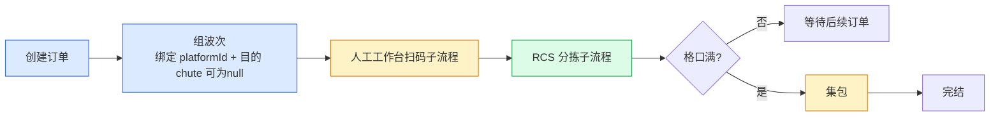
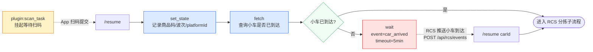
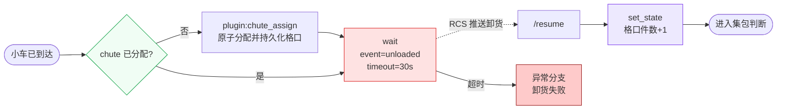
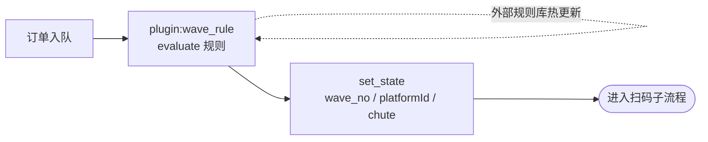

# 分拣场景规划：订单 → 组波次 → 扫码 → RCS分拣 → 集包

## 1. 场景描述

目标流程（细化）：



关键实体与标识：

- **platformId**：平台侧工作站编号，关联 RCS 地图中的站点 ID，波次绑定 platformId 决定从哪个工作站发车
- **chute（格口）**：分拣目的地，组波时确定目标格口，RCS 按 chute 调度小车
- **小车**：RCS 调度的实际载货设备，工作站扫码后需等待指定小车到达再发车

### 实现前提（已就绪能力）

本规划以下述能力**已实现**为前提，不在"缺失能力"中列出：

- **HTTP 插件机制**（`plugin:*` 节点类型、PluginExecutor、标准接口 `/descriptor` `/execute` `/resume` `/cancel`、插件注册中心、`requestId`/`runId` 透传、insertInput/statePatch/waitSignal 协议）
- **动态节点注册**（NodeDescriptor 协议，前端面板 / runner 执行器按 descriptor 路由）
- **wait 节点多阶段事件挂起与 resume**、`fetch` 节点、`code` 节点、`if_else`/`switch`/`set_state` 等编排原语
- **工作流运行观测**（SSE 事件流、run 状态机、重试、超时、终止）
- **业务插件服务本身**（`scan_task` / `dispatch_task` / `pack_task` 插件服务的具体实现由插件团队交付，本规划仅定义其契约）

因此，以下讨论聚焦**场景编排**与**平台侧需补充的业务能力**，不再重复 HTTP 插件的实现工作。

触发与交互约束：

- 订单创建支持 **webhook 推送**或**接口轮询**两种触发模式
- 组波次支持**客户规则自动组波**或**人工表单输入**，需同时决定 platformId 与目的 chute
- 人工工作台为 **App**，与系统双向数据交互（拉取任务 + 提交扫码结果 + 发车指令）
- 小车到达工作站状态由 **RCS 主动推送**（事件回调），非工作站主动查询
- RCS 为**独立系统**，内部包含完整机器人调度逻辑，通过 HTTP 接口与本系统对接
- 集包目前为**人工处理**

---

## 2. 各步骤与当前系统能力映射

### 2.1 创建订单（触发接入）

| 能力需求 | 当前支撑 | 状态 |
|---|---|---|
| Webhook 推送触发工作流 | `TriggerType::Webhook` + `webhook_trigger` 节点 | ✅ 已支持 |
| 接口轮询触发 | 需外部 cron 调 `POST /workflows/{id}/run`，系统无内建定时触发 | ⚠️ 需外部配合 |
| 订单数据标准化 / 幂等校验 | `code` 节点（内联 JS）可实现 | ✅ 可实现 |
| 多触发来源统一接入 | `TriggerType` 目前只有 `webhook/manual/event`，无 `cron` 类型 | ✅ 定时触发器 |

**备注**：webhook 路径完整可用；轮询模式需补充 `cron` 触发类型或依赖外部调度（如 K8s CronJob）调用 `/run` API。

---

### 2.2 组波次

| 能力需求 | 当前支撑 | 状态 |
|---|---|---|
| 按规则将多订单聚合为一个波次 | `wave` + `wave_order` 表提供数据层聚合；`wave_order(wave_no, run_id)` 关联多实例；触发组波仍需外部接口 | ⚠️ 数据层已就绪 |
| 定时 / 阈值 / 人工触发组波 | `plugin` 节点可承接人工触发；定时无内建支持 | ⚠️ 部分支持 |
| 人工表单输入组波参数 | `plugin` 节点下发人工任务（HTTP 插件协议）+ resume 回执 | ✅ 前提已实现 |
| 调用外部组波系统 | `fetch` 节点 HTTP 调用 | ✅ 已支持 |
| 波次生命周期管理 | `wave` 表独立聚合对象（`wave_no`、`status` 状态机）；`wave_order` 关联订单与 run 实例列表 | ✅ 已支持 |
| 波次与多工作流实例关联 | `wave_order(wave_no, run_id)` 联结波次与多工作流实例；`workflow_runs.wave_no` 反向索引 | ✅ 已支持 |
| 规则组波 | `wave.rule_version` 记录所用规则版本；无内建规则引擎，组波逻辑由外部插件执行 | ⚠️ 缺少规则引擎 |
| 波次绑定 platformId（工作站/RCS 地图 ID） | `wave.platform_id` 字段 | ✅ 已支持 |
| 波次绑定目的 chute（分拣格口，可为空） | `wave.chute_id` 字段（可为空，RCS 子流程入口分配） | ✅ 已支持 |
| platformId ↔ chute 映射关系维护 | `chute_status(chute_id, platform_id, wave_no, is_full…)` 维护格口运行态；无独立静态配置映射表 | ⚠️ 运行态已有，静态配置仍缺 |

**备注**：组波是**多订单 → 一波次**的聚合操作，数据层已通过 `wave` / `wave_order` 表实现。`wave` 表持有波次的 `platform_id`、`chute_id`、`status`、`rule_version`；`wave_order` 以 `(wave_no, run_id)` 为主键关联多个工作流实例。触发组波的聚合逻辑（何时收集足够订单、如何调用规则）仍由外部 plugin 服务或 `fetch` 节点完成，平台无内建规则引擎。

**波次与物理资源绑定**：组波完成后，波次必须携带两个物理标识才能驱动后续 RCS 调度：

- `platformId`：平台工作站编号，关联 RCS 地图站点 ID，决定从哪个工作站发车（扫码工位）
- `chute` / `chuteId`：分拣目的格口，RCS 按此 ID 调度小车至目标位置；**chute 可为空**——组波时未指定格口时，在发起 RCS 子流程前由系统随机（模拟）从空闲格口列表中分配一个格口
- 同一波次可绑定一个或多个 chute（大波次分拨到多格口）；platformId 通常为单一工作站

> 跨实例共享状态的数据模型、并发安全方案与服务层设计详见：[跨实例聚合能力实现方案](./跨实例聚合能力实现方案.md)

---

### 2.3 人工工作台（App 交互）

工作站侧为**两步子流程**（小车到达即视为确认，无需额外发车操作）：

```
扫商品码 → 等待小车到达（RCS 推送）
```

| 能力需求 | 当前支撑 | 状态 |
|---|---|---|
| 步骤1：下发扫码任务 + 接收扫码结果 | `plugin:scan_task` 节点 | ✅ 前提已实现 |
| 步骤2a：小车已到达，直接进入 RCS 子流程 | `if_else` 节点查询 RCS 状态，条件成立直接跳过 wait | ✅ 已支持 |
| 步骤2b：小车未到达，等待 RCS 推送到达事件 | `wait` 节点 + `POST /runs/{run_id}/resume` | ✅ 已支持 |
| 扫码结果关联波次 / 订单 / platformId | 插件通过 `statePatch` 返回，runner 合并到 run state | ✅ 已支持 |
| 小车到达事件路由 | RCS → 平台 webhook → 定位到等待中的 run → resume | ❌ 需实现 RCS 事件接入端点 |
| 小车当前状态查询 | `fetch` 节点调用 RCS 状态查询接口 | ❌ 需 RCS 提供查询接口 |
| 工作站并发：多订单共享同一 platformId 的小车 | 无工作站级共享状态，多 run 独立等待 | ❌ 需工作站状态服务 |

**子流程映射到节点**（Mermaid）：



**等待小车到达节点逻辑**：

- `fetch` 查询 RCS 小车当前位置，`if_else` 判断是否已在 platformId 等待
- **已到达**：直接进入 RCS 分拣子流程
- **未到达**：`wait(event=car_arrived)` 挂起；RCS 推送到达事件后，平台 webhook 调用 `POST /runs/{run_id}/resume` 唤醒，再进入 RCS 分拣子流程

---

### 2.4 RCS 调度分拣

小车到达确认后 RCS 侧执行**一子步骤**（上一环节已确认小车到达，无需发调度指令；卸货后即完成，无需等待货物落入格口事件）：

```
[小车已到达] → RCS 内部调度 → 确认卸货（翻板抬起）
```

| 能力需求 | 当前支撑 | 状态 |
|---|---|---|
| 等待 RCS 回调"卸货确认"（翻板抬起） | `wait` 节点 + resume（event=unloaded） | ✅ 已支持 |
| chute 为空时随机分配空闲格口 | `plugin:chute_assign` 节点：原子查询空闲格口、持久化分配记录，经 `statePatch` 写回 run state | ❌ 需 chute_assign 插件服务 |
| RCS 事件路由到同一 run | 需按 `run_id` 或 `request_id` 定位等待中的 run | ⚠️ 已有 `runs/search` API 支持 |
| RCS 调度超时重试 | `timeoutMs` on `wait` 节点 | ✅ 已支持 |
| RCS 失败异常分支（卸货失败、小车故障等） | `if_else`/`switch` + `onError` 配置 | ✅ 已支持 |

**子流程映射到节点**（Mermaid）：



**备注**：上一环节（人工工作台）已确认小车到达，本子流程无需发调度指令，也不等待货物落入格口事件，仅等待卸货确认（翻板抬起）。chute 为空时在子流程入口调用 `plugin:chute_assign`：插件内部原子查询空闲格口、写 DB 持久化分配记录，并通过 `statePatch: { chute }` 写回 run state，后续节点直接读 `{{ state.chute }}`。需要补的是**RCS 事件接入端点**（统一 webhook 入口 + 按 run_id/request_id 路由到对应 wait 节点）以及 **`chute_assign` 插件服务**（含原子分配逻辑与 DB 写入）。

---

### 2.5 集包（格口满触发）

| 能力需求 | 当前支撑 | 状态 |
|---|---|---|
| 判断格口是否满（条件分支） | `if_else` 节点（基于 state 中格口数据） | ✅ 已支持 |
| 格口满时触发集包操作 | `plugin:pack_task` 节点 | ✅ 前提已实现 |
| 集包完成后 App 回执 | App → 插件 `POST /resume` → runner 继续 | ✅ 前提已实现 |
| 跨多个分拣实例更新同一格口状态 | 无跨实例共享状态存储 | ❌ 核心缺失 |
| 格口资源并发写保护 | 无 | ❌ 缺失 |

---

## 3. 缺失能力汇总

### 3.1 必须补充（阻塞流程闭环）

#### A. 波次管理模块

- 波次数据对象（`wave_no`、状态机、关联订单列表、关联分拣框列表）
- 组波触发策略：定时触发、订单数阈值触发、人工触发
- 波次与多工作流实例的关联关系（一波次 → N 个订单 run）
- 波次状态 API（创建、激活、完成、异常）

#### A1. 分拨规则引擎（组波规则的核心灵活性）

分拨规则决定"哪些订单被聚合进同一波次"，是客户差异最集中的环节，必须独立于流程编排、可配置、可热更新。

**分拨维度示例**（不同客户差异显著）：

| 维度 | 示例规则 |
|---|---|
| 商品品类 | 同一波次只包含同一品类的订单 |
| 送货地区 | 按配送区域聚合，同区域订单同波次 |
| 送货日期 | 按承诺送达日分组，今日件优先 |
| 订单优先级 | VIP 订单单独成波，普通订单批量组波 |
| 仓格口容量 | 波次容量上限 = 目标料口可用格口数 |
| 客户指定 | 客户主动指定本次组波的订单范围 |
| 多维度组合 | 同品类 + 同地区 + 今日件，三条件 AND |

**规则模型设计要点**：

- 规则按**客户/仓**隔离，同一套系统运行多套互不干扰的分拨规则
- 每套规则由**条件集合**（订单字段过滤）+ **分组键**（聚合维度）+ **约束**（容量上限、时间窗）组成
- 规则支持**优先级排序**：多条规则按优先级依次命中，默认兜底规则兜底
- 规则**热更新**：修改规则不重启服务，下一次组波触发即生效
- 规则**版本管理**：变更可回滚，历史波次可追溯当时生效的规则版本

**与工作流的集成方式**：

分拨规则不内联在 workflow 节点中，而是作为独立服务，工作流通过 `fetch` 节点调用：

```
订单入队 → fetch节点(POST /wave-rules/evaluate, body={orders:[...]})
         → 返回 {wave_id, matched_orders[], rule_version}
         → set_state 写入波次信息
         → 继续后续流程
```

这样规则变更不影响流程定义，流程定义不影响规则逻辑，两者独立演进。

#### B. 跨实例共享状态存储

- 格口状态（当前件数、是否满、关联波次）需被多个 run 并发读写
- 方案选项：
  1. 新增 `shared_state` 节点类型（读写全局 KV）
  2. 在 backend 层提供格口状态资源 API，工作流通过 `fetch` 节点读写
  3. 使用已有 Postgres 增加格口状态表，暴露为内部服务接口

#### C. 定时触发器（`cron` TriggerType）

- 用于定时轮询外部系统拉取订单，或定时触发组波
- 补充 `TriggerType::Cron` 和对应的调度执行器

#### D. RCS 事件接入端点（多阶段事件路由）

RCS 在分拣过程中推送多个事件（小车到达工作站、到达格口、卸货确认、进入格口），每个事件需路由到正在等待的对应 run：

- 统一 webhook 入口：`POST /api/rcs/events`，body 携带 `eventType` + `carId` + `chute` + `platformId` + `requestId`
- 事件路由逻辑：按 `requestId` 定位 run_id，调用 `POST /runs/{run_id}/resume`，`event` 字段匹配 `wait` 节点声明的 `event`
- 事件去重与幂等：同一事件重复推送时不触发二次 resume
- 事件超时：wait 节点设置 `timeoutMs`，超时走异常分支（小车故障、卸货失败等）

#### E. 工作站与物理资源映射

- `platformId` ↔ RCS 地图站点 ID 映射表
- `platformId` ↔ chute 可达性映射（某工作站可分拨到哪些格口）
- 小车资源池状态（空闲/任务中/故障）——由 RCS 维护，平台只读
- 以上数据作为**独立配置服务**暴露 API，workflow 通过 `fetch` 读取，不硬编码在流程中

### 3.2 补充（提升可用性，非阻塞）

- **订单接入网关**：幂等 Key 管理、来源标识、标准化映射，抽象为独立模块而非每个流程内联 `code` 节点
- **App 任务中心视图**：工作台按人员/工位维度查看任务队列，由插件服务提供，不依赖 runner 层
- **格口资源服务**：独立管理料口/格口资源状态，workflow 通过 `fetch` 节点读写，不依赖共享 state

---

## 4. 近期最小可跑通路径

用现有能力 + 最小补充实现端到端验证（单订单线性路径）：

```mermaid
flowchart LR
    T0([webhook_trigger]) --> T1[code<br/>幂等+标准化]
    T1 --> T2[fetch<br/>POST /wave-rules/evaluate]
    T2 --> T3[set_state<br/>wave_no + platformId + chute]

    T3 --> SC1[plugin:scan_task<br/>挂起等扫码]
    SC1 -.App 扫码提交.-> SC1R["/resume"]
    SC1R --> SC2Q[fetch<br/>查询小车是否已到达]
    SC2Q --> SC2C{小车已到达?}
    SC2C -- 是 --> RC0{chute 已分配?}
    SC2C -- 否 --> SC3[wait<br/>event=car_arrived<br/>timeout=5min]
    SC3 -.RCS webhook.-> SC3R["/resume"]
    SC3R --> RC0

    RC0 -- 否 --> RC0P[plugin:chute_assign<br/>原子分配并持久化格口]
    RC0P --> RC3[wait<br/>event=unloaded<br/>timeout=30s]
    RC0 -- 是 --> RC3
    RC3 -.RCS webhook.-> RC5[fetch<br/>GET /chutes/:id/status]

    RC5 --> D{格口满?}
    D -- 否 --> END1([end])
    D -- 是 --> P1[plugin:pack_task<br/>挂起等集包]
    P1 -.App 确认集包.-> P1R["/resume"]
    P1R --> END2([end])

    classDef plugin fill:#fef3c7,stroke:#d97706
    classDef wait fill:#fee2e2,stroke:#dc2626
    classDef fetch fill:#dbeafe,stroke:#2563eb
    classDef state fill:#ede9fe,stroke:#7c3aed
    classDef trigger fill:#d1fae5,stroke:#047857
    classDef cond fill:#f0fdf4,stroke:#16a34a
    class T0 trigger
    class SC1,P1,RC0P plugin
    class SC3,RC3 wait
    class T2,SC2Q,RC5 fetch
    class T1,T3 state
    class SC2C,RC0 cond
```



**需新增的最小工作**（HTTP 插件机制与 `scan_task` / `dispatch_task` / `pack_task` 业务插件作为前提已就绪）：

1. 实现 RCS 事件接入端点 `POST /api/rcs/events`（按 requestId 路由 resume，含幂等）
2. 实现格口状态服务 `GET /chutes/{id}/status` + 件数累加 API；实现 `chute_assign` 插件服务（`/descriptor` + `/execute`：原子查询空闲格口、DB 写入分配记录、`statePatch: { chute }` 返回）
3. RCS 提供小车当前位置查询接口（供 `fetch` + `if_else` 判断小车是否已到站）
4. 配置 RCS 回调地址 + 在平台注册业务插件 `baseUrl`（若尚未注册）
5. 波次号、platformId、chute 暂存在 run 的 `state`，不建独立波次对象（验证阶段）；chute 为空时在 RCS 子流程入口由 `plugin:chute_assign` 原子分配并持久化，经 `statePatch` 写回 run state
6. 工作站 ↔ 格口映射用硬编码配置表先跑通，后续再做配置化

---

## 5. 中期完整平台能力路径

| 模块 | 工作内容 | 优先级 |
|---|---|---|
| 波次管理模块 | 数据模型（含 platformId、chute）+ 聚合 API + 状态机 | P0 |
| 分拨规则引擎 | 规则模型 + 评估 API + 热更新 + 版本管理 | P0 |
| 跨实例共享状态 | 格口状态服务 或 shared_state 节点 | P0 |
| 业务插件契约对齐 | 与插件团队对齐 scan_task / dispatch_task / pack_task 的 configSchema / statePatch / waitSignal 字段 | P0 |
| RCS 事件接入端点 | 统一 webhook + requestId 路由 + 幂等 | P0 |
| 工作站资源映射服务 | platformId↔chute 映射 + 小车状态只读 API + 小车是否已到达查询 | P0 |
| cron 触发器 | TriggerType::Cron + 调度执行器 | P1 |
| 订单接入网关 | 幂等 + 标准化独立模块 | P1 |
| 多客户规则隔离 | 组波规则 / 料口规则按客户/仓配置 | P1 |

---

## 6. 关键设计决策

### 组波的实现模式选择

两种选项：

**选项 A：波次作为独立工作流实例**

- 订单接入后写入"待组波队列"
- 组波触发器创建一个波次 run，聚合订单列表
- 波次 run 驱动后续扫码/RCS/集包流程

**选项 B：波次作为共享数据对象，每笔订单独立 run**

- 每笔订单一个 run，run 关联 `wave_no`
- 波次状态由独立 API 管理
- 扫码/RCS/集包步骤在各自 run 中执行

**选项 B**：与当前 runner 单实例模型更契合，波次聚合逻辑收敛在波次管理服务层，不改变 runner 核心。

### 格口满的判断时机

- 每次 RCS 回调（货物进入格口）后，run 通过 `fetch` 读取格口服务状态
- 若格口满，当前 run 触发集包任务；其余 run 在下一次分拣完成时重新检查
- 避免多 run 并发触发同一格口集包（需格口服务提供 CAS 或锁机制）

### RCS 事件路由方式

RCS 推送多阶段事件（小车到达、卸货、进入格口），需精准路由到对应等待中的 run：

**选项 A：按 run_id 路由**
- 下发 RCS 指令时，在 body 中携带 `run_id` 作为回调标识
- RCS 回推事件时带上 `run_id`，平台直接 `POST /runs/{run_id}/resume`
- 优点：简单直接；缺点：run_id 暴露给外部系统

**选项 B：按 requestId 路由**（推荐）
- 每次业务请求生成独立 `requestId`，传递给 RCS
- 平台维护 `requestId → run_id` 映射，按 requestId 定位 run
- 优点：requestId 是业务语义标识，RCS 侧也用于联查；与插件协议透传的 requestId 一致
- 缺点：多一层映射，但 `WorkflowRunRecord` 已有 `request_id` 索引字段可直接用

推荐**选项 B**：与现有 `runs/search` API 支持的 `request_id` 查询字段契合，RCS 侧也更符合业务语义。

### 工作站扫码三步的实现方式

"扫码 → 等待小车 → 发车"三步之间有 RCS 异步事件，**不推荐**合并为一个插件节点：

- 合并后插件需长时间挂起并轮询 RCS，状态管理复杂
- 拆为 `plugin:scan_task` + `wait(car_arrived)` + `plugin:dispatch_task` 三段，职责清晰
- 每一段都可独立重试、独立观测、独立异常分支
- 工人在 App 上看到的任务也分为"扫码任务"和"发车任务"两类，语义更清晰

### 分拨规则的承接方式

由于"HTTP 插件机制"已作为前提就绪，分拨规则的首选承接方式调整为**插件节点**。四种选项对比：

**选项 1：`code` 节点内联**（不推荐）
- 规则逻辑写在流程的 `code` 节点 JS 中
- 修改规则 = 修改流程定义，需重新发布流程
- 多客户规则混在同一流程，难以隔离

**选项 2：`plugin:wave_rule` 插件节点**（✅ **推荐首选**）

把分拨规则按**插件契约**承接，复用已就绪的 HTTP 插件机制：



- 规则服务实现标准 `/descriptor` + `/execute` 接口：
  - 输入：当前订单（+ 候选订单池）+ 客户/仓上下文（通过 `context` 字段）
  - 输出：`statePatch: { wave_no, platformId, chute, rule_version }` + `output: { matched_orders }`
- 不同客户 / 不同规则集可注册为**同一 `runnerType` 下的多个插件实例**，通过 `config.ruleSetId` 选择
- 支持 `status: "waiting"` — 需等订单池积攒到阈值再返回分组结果（与人工表单输入 + 阈值触发组波场景天然契合）
- 天生获得：descriptor 自描述、configSchema 驱动前端面板、`requestId`/`runId` 透传、统一日志与观测、注册中心管理、灰度/版本

**选项 4：平台内建规则中心 + `plugin:wave_rule` 调用**（中期建设）
- 规则中心提供**可视化规则配置界面**（条件、分组键、约束、优先级），规则通过 PRD 第 8.2 节的规则模型承接（决策规则 + 计算规则 + 约束规则）
- 规则中心本身以"内置插件"形式暴露给 workflow，runnerType 仍是 `plugin:wave_rule`，workflow 无需变更
- 把规则中心当作"平台自带的一个特殊插件实例"，与客户自研规则插件共存

**推荐路径**：

- **近期**：实现一个最小的 `wave_rule` 插件服务，承接"同品类 + 同地区 + 今日件"三条件 AND + 阈值触发，跑通端到端
- **中期**：规则中心上线后，把它注册为平台默认的 `wave_rule` 插件实例；客户可注册自有插件覆盖默认
- **特殊场景**：客户已有组波系统且不愿改造 → 包一层薄插件 shim（HTTP 插件服务直接调客户接口），不回退到选项 2

**关键原则**：

- 分拨规则不内嵌在流程节点中，规则变更不触发流程重新发布
- 统一走插件协议，不为规则单独引入一套"规则服务"的 API 规范
