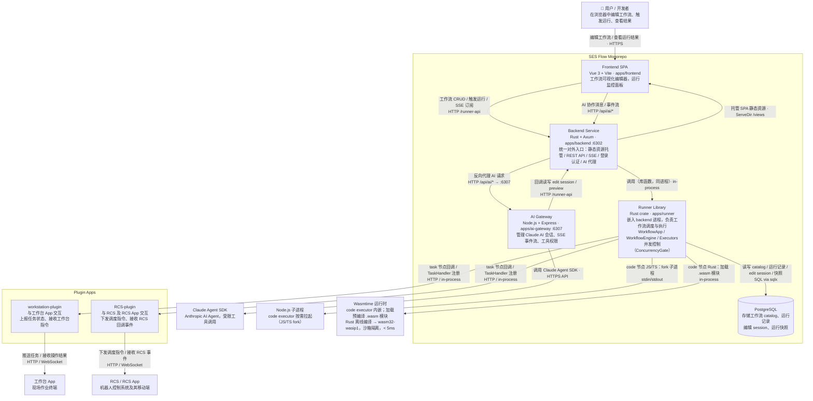
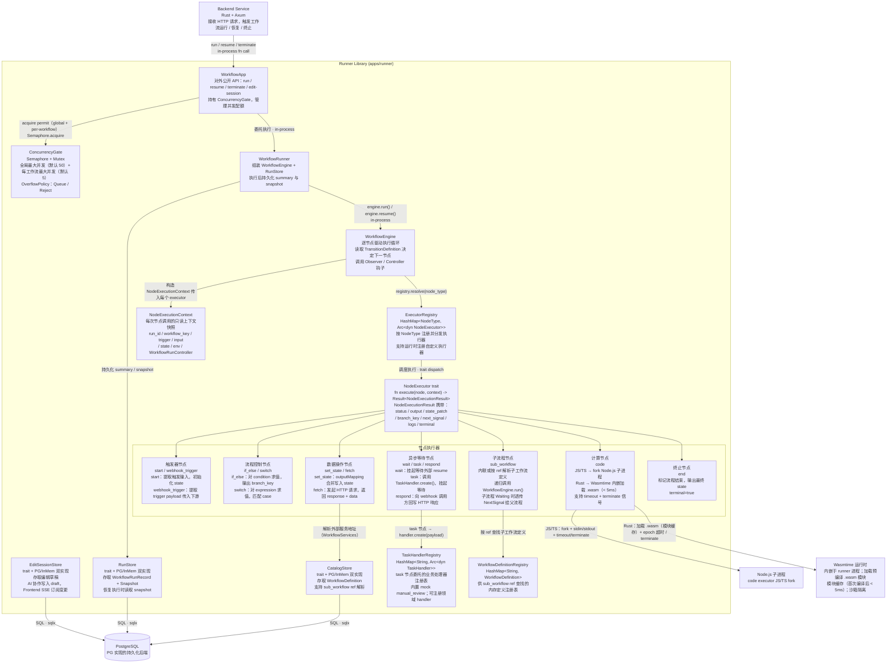

# 系统框架

## 一、容器图（Container Diagram）



---

## 二、Runner 节点执行设计（Component Diagram）



### NodeExecutionResult 语义

| `status` | 含义 |
|---|---|
| `success` | 继续执行下一节点 |
| `waiting` | 挂起；保存 snapshot；等待 `resume(run_id, signal)` |
| `failed` | 触发 `onError` 策略或终止 |

- **`terminal=true`**：无论 status，立即结束工作流
- **`branch_key`**：传给 `Transition.condition` 决定分支
- **`state_patch`**：merge 到全局 workflow state
- **`next_signal`**：异步节点产出，随 SSE 推送给前端

### 恢复流程（resume）

1. 从 `RunStore` 读取 `WorkflowRunSnapshot`
2. snapshot 包含：`currentNodeId` / `trigger` / `lastInput` / `state` / `timeline` / `lastSignal` / `env`
3. `WorkflowEngine` 从 `currentNodeId` 继续执行
4. 支持手动 patch（manual-patch API）修改恢复时注入的 input

---

## 三、Plugin Apps

Plugin Apps 是挂载在 Runner 侧的领域插件，通过实现 `TaskHandler` trait 注册到 `TaskHandlerRegistry`，由 `task` 节点在工作流执行时委托调用。

| Plugin | 职责 | 对接外部系统 |
|---|---|---|
| **workstation-plugin** | 与工作台 App 交互：向现场作业终端推送任务、接收操作员确认/拒绝结果，将结果作为 `resume signal` 回写 Runner | 工作台 App（现场终端） |
| **RCS-plugin** | 与 RCS 及 RCS App 交互：向机器人控制系统下发调度指令、监听 RCS 回调事件，将执行结果作为 `resume signal` 回写 Runner | RCS / RCS App（机器人控制系统及移动端） |

### 典型交互流程

```
WorkflowEngine
  └─ task 节点 → TaskHandlerRegistry.dispatch(handler_key, payload)
       ├─ workstation-plugin.create(payload)
       │     → 推送任务到工作台 App
       │     → 工作台 App 操作后回调 plugin
       │     → plugin 调用 Runner resume(run_id, signal)
       └─ rcs-plugin.create(payload)
             → 下发调度指令到 RCS
             → RCS 执行完毕后回调 plugin
             → plugin 调用 Runner resume(run_id, signal)
```
